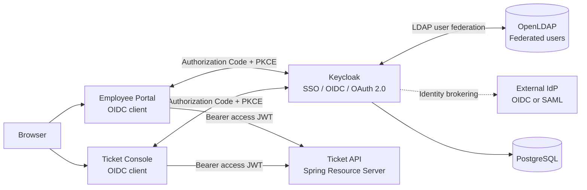

# Architecture

## Mental model

- **LDAP**: where a corporate user can come from.
- **OIDC**: how an application learns that the user authenticated.
- **OAuth 2.0**: how clients obtain tokens for protected resources.
- **JWT**: a signed token format used here for ID/access tokens.
- **SSO**: reuse of the Keycloak browser session across multiple clients.
- **SAML**: an alternative enterprise federation protocol, used here conceptually for external IdPs/legacy systems.
