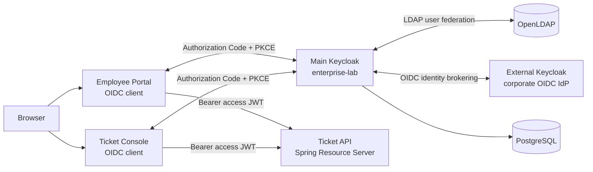

# Architecture


```mermaid
flowchart LR
    B[Browser]
    EP[Employee Portal\nOIDC client]
    TC[Ticket Console\nOIDC client]
    KC[Main Keycloak\nenterprise-lab]
    LDAP[(OpenLDAP)]
    API[Ticket API\nSpring Resource Server]
    PG[(PostgreSQL)]
    EIDP[External Keycloak\ncorporate OIDC IdP]

    B --> EP
    B --> TC
    EP <-->|Authorization Code + PKCE| KC
    TC <-->|Authorization Code + PKCE| KC
    KC <-->|LDAP user federation| LDAP
    KC <-->|OIDC identity brokering| EIDP
    KC --> PG
    EP -->|Bearer access JWT| API
    TC -->|Bearer access JWT| API
```

## Trust chain

```text
External IdP authenticates external-alice
              |
              v
Main Keycloak trusts that OIDC result
              |
              v
Main Keycloak issues enterprise-lab JWT
              |
              v
Spring API validates Main Keycloak JWT
```

LDAP federation is different: Main Keycloak directly talks to a directory. In identity brokering, Main Keycloak redirects authentication to another IdP and trusts the protocol result.
